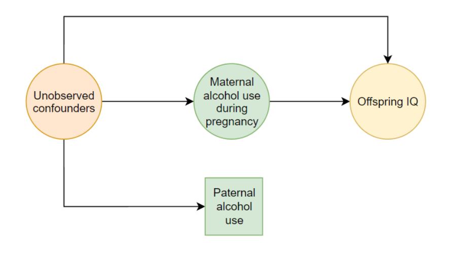

```{r setup, include=FALSE}
knitr::opts_chunk$set(echo = FALSE, warning=FALSE, error=FALSE, message = FALSE)
options(scipen=9999)
knitr::opts_knit$set(eval.after = "fig.cap")
set.seed(10033)
```

I recently read Emily Oster's book: [Expecting Better: Why the Conventional Pregnancy Wisdom is Wrong—and What You Really Need to Know](https://www.goodreads.com/book/show/16158576-expecting-better?from_search=true&from_srp=true&qid=5FmElbF5mM&rank=1). Oster proposes using decision theory to use data on different activities during pregnancy to make decisions that best reflect your preferences.

The most controversial aspect of the book has been her claim that there is no risk to light drinking during pregnancy. This view has been criticized quite intensely, but I think these critiques don't get to the heart of the issue.[^critiquesbad] While I don't think the evidence is decisive either way on light drinking and pregnancy, Oster's analysis implicitly builds in some strong statistical assumptions that readers should carefully consider before they accept her conclusions.

[^critiquesbad]: I'll talk through some of my issues with those in a future post.

Oster starts by saying:

> One phrase I kept coming across was “no amount of alcohol has been proven safe.” The implication, I suppose, is that we know that there exists a level of drinking that is bad, so we should assume all other levels are bad until proven otherwise.

I think that is a slightly unfair read of what the conventional wisdom is saying. I think a charitable reading of the conventional wisdom is as follows: "We know that there is a level of drinking that is bad and that at some point (probably before literally zero drinking) its effect falls very close to zero". 

This view implies a prior that looks something like the following:[^simulateprior]


```{r}


effect <- c(rep(0,10000), -rexp(10000) * 2, rexp(100)/5)

dat <- data.frame(Effect = effect)
library(ggplot2)

ggplot(dat, aes(x = Effect)) + geom_histogram(bins=  100) + 
  xlab("Effect of light drinking on child IQ") + theme_minimal() + 
  scale_y_continuous(labels = NULL) + 
  ylab("Prior probability") + 
  ggtitle("Asteroid prior")


```

[^simulateprior]: The distribution is simulated as follow in R: c(rep(0,10000), -rexp(10000) * 2, rexp(100)/5). 49.8% of the prior probability mass is on an effect of exactly zero, 49.8% spread over an exponential distribution in the negative direction and 0.5% spread over a positive exponential distribution.

There's a large point mass at exactly zero, but a non-zero probability that the effect is actually negative. Crucially, this view gives zero (or trivially low) credence to the idea that light drinking might boost child IQ. 

I'm going to refer to this colloquially as the asteroid prior. The effect of an asteroid is usually exactly zero (because it misses the earth or burns up in the atmosphere), but if it does get through, the outcomes are all some version of bad.[^korea] In this analogy, the scientific question is just whether alcohol makes it through to cause harm, no one disagrees about the direction of the effect if it does.

[^korea]: I've added on a small tail of positive outcomes to the prior  (perhaps the asteroid hits Vladmir Putin and ends the invasion of Ukraine), but for the levels of evidence we're talking about it's not going to matter. 

You might think that holding an asteroid prior such as this is unscientific and that no quality of evidence could ever convince someone who holds it. While it is true that this prior will always say that light drinking is bad in expectation, high quality evidence could hypothetically reduce the plausible effect size to very close to zero and make the probability that the effect size is exactly zero arbitrarily high. If the evidence suggested that there is a 99% chance that the effect is exactly zero and that—if it is non-zero—there is a 99% chance that the effect has a smaller magnitude than 0.2 IQ points, few people would think it was worth advising against light drinking.

My read of Oster is that she is implicitly interpreting all the studies using a symmetric prior (e.g. the one below) around zero.[^frequentist] This is a very standard assumption in social science studies, as we rarely have strong enough theories to convincingly rule out effects in a particular direction. There are good arguments for minimum wages increasing employment or for decreasing it. If you ran a minimum wage study with a heavily asymmetric prior, you would rightly be called out for stacking the deck. 

[^frequentist]: It's worth noting that the actual studies under discussion all use frequentist methods. The Bayesian language here is a way of conceptualizing how a reader could reasonably update their views based on reading the studies. You certainly could formalize this into a Bayesian meta-analysis, but the concepts from Bayesian statistics are helpful even when doing this informally. Note that if you were to do this formally, you would want to include latent estimates of measurement error at the study level as part of the estimation. 

```{r}
effect <- c(rnorm(20000, sd = 2))

dat <- data.frame(Effect = -effect)
library(ggplot2)

ggplot(dat, aes(x = Effect)) + geom_histogram(bins=  100) + 
  xlab("Effect of light drinking on child IQ") + theme_minimal() + 
  scale_y_continuous(labels = NULL) + 
  ylab("Prior probability") + 
  ggtitle("")
```

So which prior should we be using when assessing the alcohol and pregnancy literature. I'm not a biologist, but the asteroid prior seems to fit quite well with Oster's own account of the mechanisms:

> When you drink… Your liver processes the alcohol into a chemical called acetaldehyde and then into acetate. The acetaldehyde is toxic to other cells, and depending on how quickly you drink, it can remain in your bloodstream. You share your blood with your baby through the placenta; acetaldehyde, which remains in your bloodstream, is therefore shared with the fetus…**If too much acetaldehyde is passed to the baby, it can get into his tissues and impact development. When you drink slowly, you metabolize much of the alcohol before it would get to the fetus. If you drink quickly, your liver cannot keep up and toxins are passed to the fetus.**

The story here is that alcohol is bad, but the mother's body is probably capable of dealing with the negative effects of it before it reaches the fetus. Notably, there's no counterbalancing story here about perhaps acetaldehyde having some positive effects in the right dose. The story also doesn't a priori rule out an effect of light drinking. Instead, the effect is dependent on the empirical facts about how fast and effectively the liver can remove the toxins, the concentration of acetaldehyde required to cause tissue damage etc. The story also doesn't rule out the possibility that some subset of women's bodies will fail to remove the toxins fast enough to avoid damage (maybe depending on ethnicity or body mass?). 

So what does the evidence Oster cites say? Is it strong enough to at least shift the asteroid posterior to a large point mass at zero and a small effect otherwise? I'm not aiming to do a literature review of the pregnancy and alcohol literature here, but having read the studies Oster approvingly cites, I'm not convinced that the evidence is strong enough to make us strongly update our posterior.

There are some studies showing negative effects of light alcohol consumption on development, but Oster is skeptical about the quality of these studies. I generally agree with her assessment and agree that the studies she prefers are stronger.[^independent] Oster's preferred studies are a large Australian prospective cohort study and a similar study on women in England. Not only do these studies not find a negative effect of drinking on IQ:

[^independent]: Since I haven't done a full review of the literature I can't independently say whether the studies she highlights on each side are representative of the literature or whether newer studies show the same results. 

>many of these studies actually find that women who drink moderately in pregnancy have children with higher IQ scores

A positive effect of drinking on IQ sounds like good news for Oster's case. If you have a prior that is symmetrical around zero, the Australian study may represent some modest evidence about light drinking being safe or maybe even slightly beneficial.

However, if you have an asteroid prior, you probably don't believe the positive effect and instead see it as evidence that the study is confounded. This seems to be the view of the researchers:

> Most researchers agree this effect is probably not causal, and may be due to the fact that women who drink moderately, at least outside of the United States, tend to be better educated than those who do not.

But is a positive effect at least evidence in favor of exactly zero effect size? What if the confounder is sufficient to actually reverse the effect direction? Oster addresses this concern by saying: 

> The English study I mentioned above is a good antidote to this concern: the authors are able to use the drinking behavior of fathers to adjust for these baseline differences. And, reassuringly, they find no effect of light drinking on IQ.
 
This interpretation of null results after adjusting for confounders is ubiquitous in social science, but it's probably incorrect.

If we look at that [study](https://www.nature.com/articles/pr2008261/tables/4), we see that the authors initially find positive effects of drinking on IQ and that this effect gradually decreases to zero after they load the model up with a huge number of sociodemographic controls.

In fact, they only get the effect size to zero once they control for unmeasured confounders using father's behavior as a proxy. The large drop in effect size when controlling for father's behavior should be a big warning sign. The fact that the father controls change the results, shows that the father proxy is capturing something important that is not captured in the other control variables. 

But whatever the father effect is capturing, it is presumably only an imperfect proxy for the true causal variables. This actually means that our best guess about what the effect would be if we fully controlled for what the father effects are proxying for should be a negative effect on IQ (although there could be other countervailing effects we have missed). 

Here's a quick simulation to show this intuition. I'm simulating the following causal graph where each of the arrows is causal probabilistically. 



Mother's social background is an unobserved variable:

```{r, echo=T}
socialbackground <- rnorm(1000)
```

And the mother's drinking behavior is partially a function of her social background:

```{r, echo=T}
drinking <- rnorm(1000) + socialbackground

```

Women pick partners with similar values on this unobserved social background:
```{r, echo=T}
partnerbackground <- socialbackground + rnorm(1000)
```

And the partner's drinking behavior is also partially a function of their social background:

```{r, echo=T}
partnerdrinking <- partnerbackground + rnorm(1000)
```

We then say that the child's IQ is a function of the mother's social background and her drinking behavior. 


```{r, echo  = T}
childiq <- 2.5*socialbackground - 1 * drinking + rnorm(1000)
childiq <- scale(childiq)[, ]
```

Without controls, it looks like mother's drinking has a positive effect on child IQ:
```{r}
library(tidyr)
library(dplyr)
library(knitr)
library(broom)
lm(childiq~drinking) %>% tidy() %>% 
  kable(col.names = c("Predictor", "B", "SE", "t", "p"),
    digits = c(0, 2, 3, 2, 3))
```


But once you control for partner's drinking behavior, that effect falls to zero:
```{r}
lm(childiq~drinking + partnerdrinking) %>% tidy() %>% 
  kable(col.names = c("Predictor", "B", "SE", "t", "p"),
    digits = c(0, 2, 3, 2, 3))
```

But we know that the true effect is actually negative (because that's what I wrote in the simulation) and the fact that the effect went from positive to zero after including a noisy control is evidence that the true effect is negative. i.e. if we had a less noisy measurement of the confounder it would continue to move the effect in the same direction. Confounder adjustment doesn't move things closer and closer to zero as you measure it better, but continues in the same direction as when you included the noisy version of the variable. 

This fact[^exceptions] is not widely recognised and it affects pretty much all selection-on-observables studies:

[^exceptions]: You can construct versions of this that don't work if you add additional unmeasured confounders, interactions or non-monotonicity, but if you don't have reasons to think those are working in the other direction, your expectation should be that the effect of including better measures would be to move your estimate further in the direction that the noisy control variable moved it.

<blockquote class="twitter-tweet"><p lang="en" dir="ltr">Suppose you read a study finding a strong positive result but with a single obvious confounder. After including a very noisy measure of the confounder, the effect falls to very near zero. What is the likely direction of the true effect?</p>&mdash; Jon Mellon (@jon_mellon) <a href="https://twitter.com/jon_mellon/status/1471519404668116993?ref_src=twsrc%5Etfw">December 16, 2021</a></blockquote> <script async src="https://platform.twitter.com/widgets.js" charset="utf-8"></script>

But back to the pregnancy and alcohol literature. Taken together, I think the studies Oster cites provide strong evidence that the drinking→IQ relationship is heavily confounded. The fact that the effects fall to zero when a noisy version of the confounder is included in the model is (weak) evidence that the true effect is negative. 

Combined with an asteroid prior, the evidence Oster presents leaves me highly uncertain but believing that alcohol consumption could have meaningful negative effects. 

But does this approach prove too much? Would this lead us to think that everything is dangerous no matter what evidence is presented? Oster writes that:

> too much anything can be bad. Tylenol overdose can lead to liver failure. In an extreme, even too much carrot juice would overdose you on Vitamin A. And yet Tylenol is routinely suggested to and taken by pregnant women, and no one would suggest limiting carrot juice.

I think these examples actually help to clarify what's going on.

First of all, in the case of Tylenol (paracetamol in the UK), it looks like the consensus *is* [actually shifting](https://www.everydayhealth.com/pregnancy/international-committee-urges-caution-in-tylenol-use-during-pregnancy/) towards something similar to alcohol consumption advice, so that's less clearcut.

The carrot juice case is interestingly different, however. For carrots, a symmetric prior around zero for the effects is much more reasonable. Carrots have plenty to recommend them in terms of nutritional content, so there's no a priori reason to think that the negative effects of very high carrot juice consumption generalize to the lower level and—crucially—there is plenty of well-grounded (in evidence and theory) offsetting benefits to the lower level of consumption.

If we knew that the only relevant effect of carrot juice was the potential negative effects of vitamin A and that there were no possible positive effects at any level, we would probably want to be more cautious about recommending it. 

I'm not making recommendations or drawing firm conclusions either way on this topic. But I think it is important to recognise that Oster's conclusions could be reversed if the studies she cites haven't fully controlled for social background and that her summary of the evidence is implicitly allowing that alcohol might be beneficial in pregnancy.